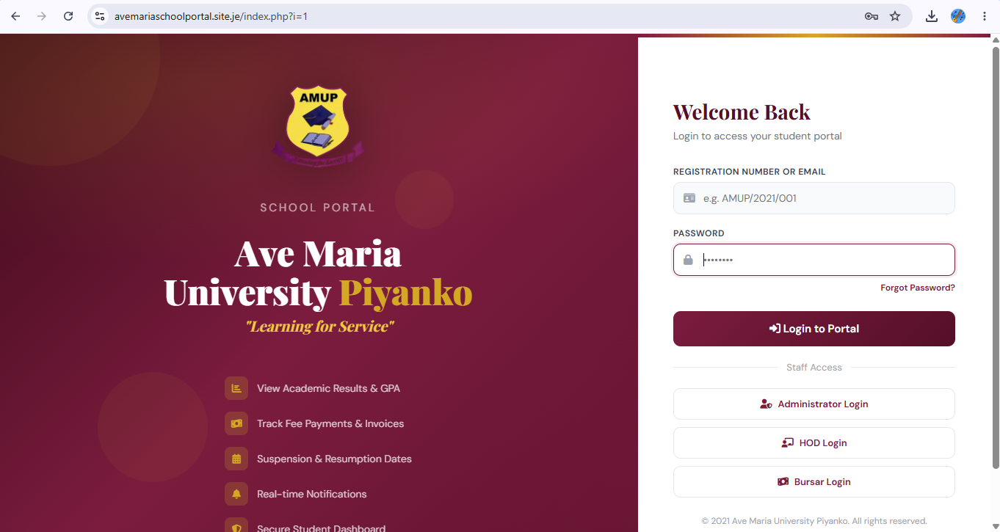
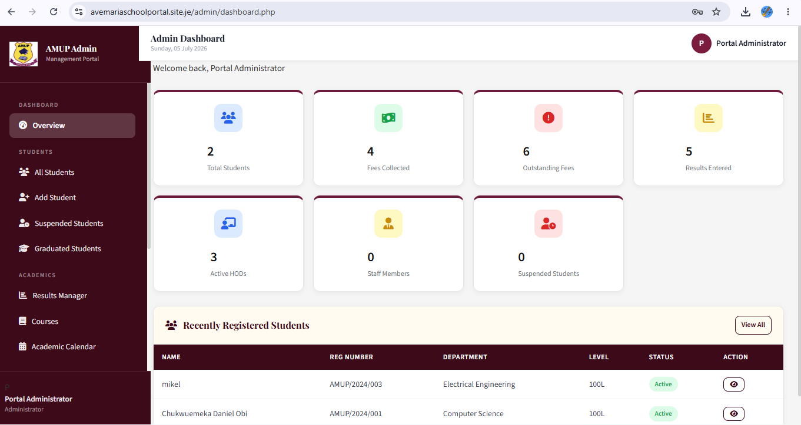

# AMUP — Ave Maria University Portal

A full-featured university management portal built with PHP & MySQL, supporting multiple roles: Students, Admins, HODs (Heads of Department), and Bursars.

> "Learning for Service" — built for Ave Maria University, Piyanko

## Live Demo
avemariaschoolportal.site.je

## Features

### Student Portal
- View academic results and GPA/CGPA
- Track fee payments and invoices
- View suspension and resumption dates
- Real-time notifications
- Secure personal dashboard

### Admin Portal
- Manage students, courses, and departments
- Generate printable student ID cards directly from a student profile view
- Department-aware graduation session tracking and automated calculation
- Manage HODs and staff records
- Academic calendar management
- Handle student suspensions

### HOD Portal
- Department-specific student results management
- View student academic details
- Role-restricted access per department

### Bursar Portal
- Record and track fee payments
- Generate payment receipts
- View fee summaries and outstanding balances

## Tech Stack
- Backend: PHP, MySQLi
- Database: MySQL
- Frontend: HTML, CSS, JavaScript
- Dependency Management: Composer

## Security Notes
- Passwords are hashed using PHP's password_hash()
- Role-based access control across 4 distinct user types
- Database credentials are excluded from version control via .gitignore

## Screenshots

Login Page

Admin Dashboard

## Setup Locally
1. Clone this repo
2. Import amup_portal.sql into your MySQL server
3. Create an includes/db_config.php file with your own database credentials
4. Run composer install to install dependencies
5. Point your local server (XAMPP/WAMP) to the project folder

## Author
Built by Paschal (Lupin Tech)
